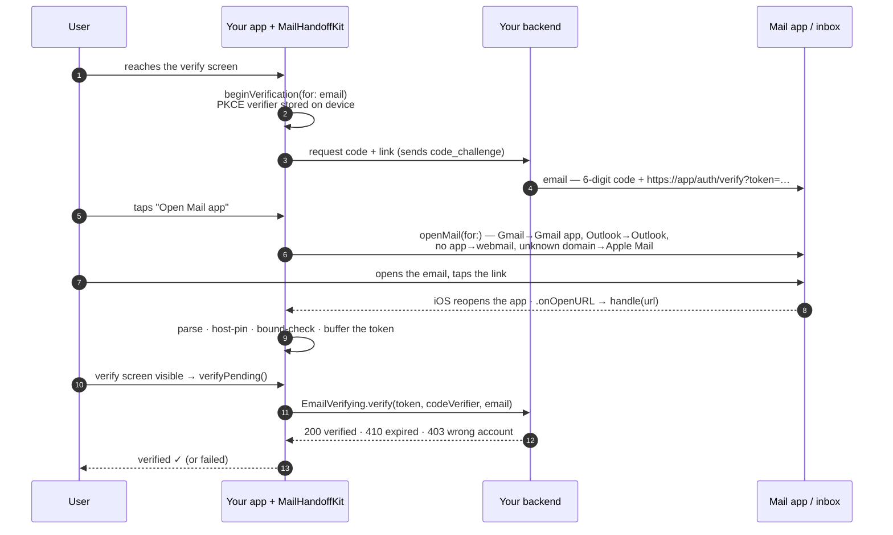
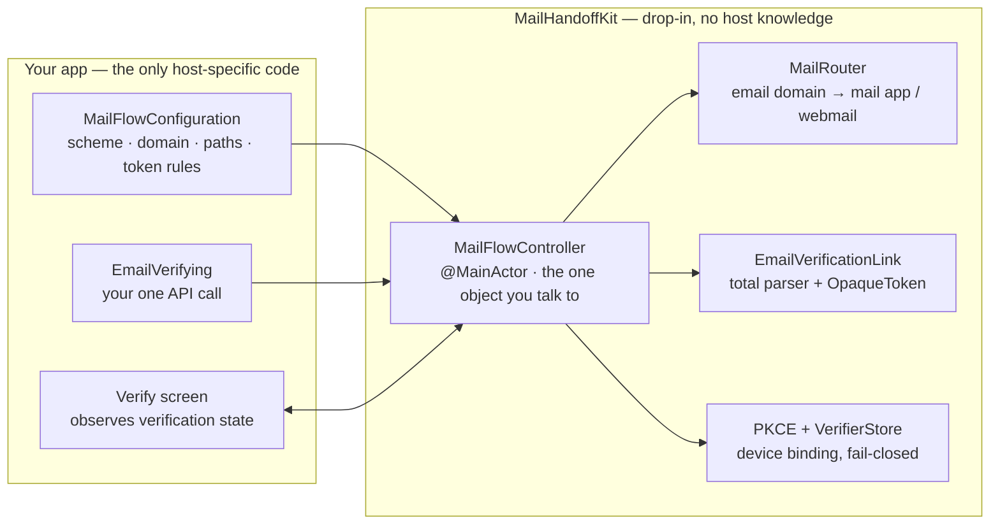

# MailHandoff

Take a user from your **verify screen to their mail app**, then bring them back from
the emailed link and **verify the token** — provider-aware, config-driven, security
hardened, and drop-in for any SwiftUI app.

This repo is a small **demo app** wrapped around a self-contained module,
[`MailHandoffKit`](MailHandoffDemo/MailHandoffKit/). The module has zero knowledge of
any host app — you pass it one configuration value and one backend implementation.

---

## Why

Email OTP has no iOS autofill. The usual flow is: *"we sent you a code"* → user
leaves to find it → comes back and types it. This kit makes that a one-tap round trip:

1. **Out** — `openMail(for:)` sends the user to the right app: Gmail address → Gmail
   app (or `mail.google.com` if it isn't installed), Outlook → Outlook, iCloud →
   Apple Mail, unknown/corporate domain → Apple Mail or a generic fallback.
2. **Back** — the email link (`https://…/auth/verify?token=…`) reopens the app;
   the kit parses it, hands the token to *your* backend, and publishes
   `verified` / `failed`.

## How it works



### What's the kit vs. what's yours



## Security model

**Built into the kit:**

- **PKCE (RFC 7636)** — the link is bound to the device that requested it. An
  intercepted or forwarded link can't be redeemed without the on-device verifier.
- Token is **opaque** and redacted in `description`; URL logs are `scheme://host/path`
  only — the token is never logged or sent to analytics.
- **Total parser** — any URL in, never crashes; bounded URL/token length, configurable
  token alphabet, Universal-Link host pinning, custom scheme opt-in (off by default).
- Verification is a **server round-trip** — the client never flips state locally.
- Token is **buffered, not auto-run** — verification happens only from a visible
  screen (user present). Cold start with no verifier **fails closed**.
- In-flight verification is cancelled on a new one; last token kept only as a hash.

**Your backend must enforce** (documented in the [kit README](MailHandoffDemo/MailHandoffKit/README.md#security-model)):
single-use tokens, short TTL, `code_verifier` check, cross-account rejection,
rate limiting, scoped AASA, `Referrer-Policy: no-referrer` on the landing page.

## Layout

```
MailHandoffDemo/
├── MailHandoffKit/          ← drop this folder into any project
│   ├── MailFlowConfiguration.swift   every app-specific value
│   ├── MailApps.swift                MailClient, MailProvider, MailRouter (pure)
│   ├── EmailVerificationLink.swift   OpaqueToken + the total URL parser
│   ├── PKCE.swift                    RFC 7636 device binding
│   ├── VerifierStore.swift           holds the PKCE secret between request & redemption
│   ├── MailFlowController.swift      the one @MainActor object the host talks to
│   └── README.md                     integration + security contract
├── MailHandoffDemoApp.swift  ← config + wiring (the only host-specific code)
└── DemoVerifyView.swift      ← a screen exercising the whole flow
MailHandoffDemoTests/         ← 30 Swift Testing cases
```

## Quick start

1. Copy `MailHandoffDemo/MailHandoffKit/` into your project.
2. Add to **Info.plist**: `LSApplicationQueriesSchemes`
   (`googlegmail`, `ms-outlook`, `ymail`, `protonmail`, `readdle-spark`, `message`)
   and — for production — an `applinks:` Associated Domain.
3. Provide one config and one `EmailVerifying` implementation, then:

```swift
@StateObject private var mailFlow = MailFlowController(config: .app, verifier: LiveEmailVerifier())

RootView()
    .environmentObject(mailFlow)
    .onOpenURL { mailFlow.handle($0) }
```

Full steps and the `LiveEmailVerifier` template: **[MailHandoffKit/README.md](MailHandoffDemo/MailHandoffKit/README.md)**.

## Run the demo

Open `MailHandoffDemo.xcodeproj`, run on a simulator, then:

```bash
xcrun simctl openurl booted "mhdemo://verify?token=demo-token-abcdef123456"
```

The app foregrounds → `verifying…` → `verified`. See
[`MANUAL_TEST.md`](MANUAL_TEST.md) for the full acceptance matrix.

## Test

```bash
xcodebuild test -project MailHandoffDemo.xcodeproj -scheme MailHandoffDemo \
  -destination 'platform=iOS Simulator,name=iPhone 17 Pro' \
  -only-testing:MailHandoffDemoTests
```

## Status

The demo ships a stub verifier (`DemoVerifier`, always succeeds). To go live, implement
`EmailVerifying` against your endpoint and swap it into the controller — ~15 lines.
Everything else (routing, parsing, buffering, PKCE, redaction, dedupe, fail-closed) is
done and tested.

## Requirements

iOS 15+ · Swift 5.9+ · SwiftUI. Uses `ObservableObject` for legacy-codebase
compatibility.
